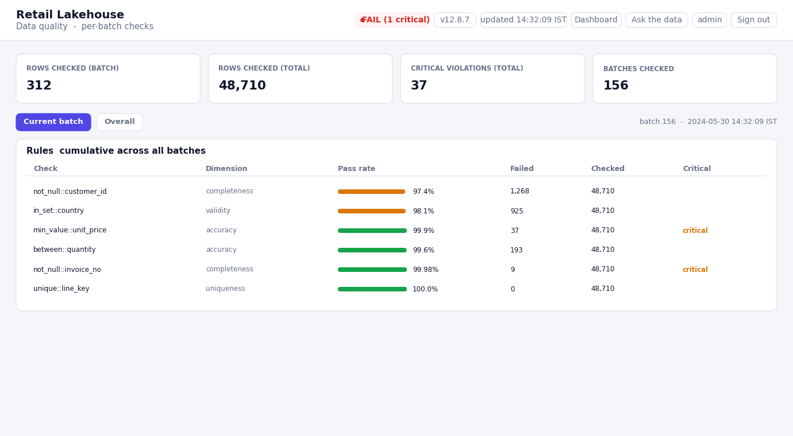

# retail-lakehouse

[](https://github.com/devbansal0905/retail-lakehouse/actions/workflows/ci.yml)

A **real-time** retail analytics lakehouse. A continuous event stream flows through a
Delta **medallion** pipeline (bronze → silver → gold) with per-batch **CDC MERGE** and
**Change Data Feed**; data-quality results and serving state live entirely in **Delta
control tables**; and a **FastAPI + Server-Sent Events** dashboard reads those Delta
tables directly and updates live in the browser the moment the data changes.


### Live dashboard


### Live data quality (`/quality`)


## Stack
`PySpark Structured Streaming` · `Delta Lake` (MERGE + Change Data Feed) ·
`FastAPI` + `Server-Sent Events` · `delta-rs` + `DuckDB` (read path) ·
`Neo4j` (metadata knowledge graph) · optional `Gemini` for NL-to-SQL ·
runs locally, in Docker, or on Databricks.

---

## How it flows

| Stage | Module | What happens |
|-------|--------|--------------|
| **Producer** | `src/producer.py` | Continuously emits synthetic sales events (one JSON file per tick) into the landing zone — stands in for Kafka/Kinesis/Event Hub. ~4% of lines are corrupted with realistic, weighted data issues so every DQ rule has something to catch. |
| **Streaming pipeline** | `src/stream_pipeline.py` | `readStream` on the landing zone; per non-empty micro-batch: append to **bronze**, **MERGE** into **silver** (idempotent CDC upsert, Change Data Feed on), read the silver **CDF** for that version, fold the deltas into compact **gold** state, then run data quality and **MERGE the result into the Delta control tables**. No state is held in memory. |
| **Incremental gold** | `src/gold_incremental.py` | Reads only the silver **Change Data Feed** delta, signs each change (`+1` insert/postimage, `-1` delete/preimage), and folds it into additive state tables (`gold_invoice`, `gold_product`) via an additive Delta MERGE (`t.metric + s.metric`). Per-batch cost scales with change volume, not silver size. |
| **Silver transforms** | `src/silver_transform.py` | Cast types, flag cancellations, filter invalid rows, dedupe, deterministic `line_key` (sha256 of the natural key); concurrency-safe MERGE with a `DeltaConcurrentModificationException` retry loop. |
| **Data quality** | `src/dq_checks.py` + `src/dq_rules.py` + `src/dq_control.py` | Rules-driven engine run on **every micro-batch**: declarative rules → check registry → single Spark pass, scored per DAMA dimension, critical-rule gating. Results are written to Delta **control tables** — an append-only `dq_runs` log plus a cumulative `dq_control` (additive MERGE). |
| **Serving (read path)** | `src/serving.py` | Reads the gold state and DQ control tables **directly from Delta** with `delta-rs` + DuckDB SQL — no Spark/JVM in the web process and no snapshot file. The combined Delta **version** of those tables is the SSE change signal. |
| **Realtime web** | `src/realtime_app.py` + `src/auth.py` | FastAPI with a username/password **login** (users in Neo4j, PBKDF2-hashed; session cookie). Pages: dashboard `/`, **`/chat`** (NL-to-SQL with per-session history), **`/quality`** (live data quality). APIs: `/stream` (SSE), `/api/kpis`, `/ask`, `/history`. |
| **NL-to-SQL** | `src/nl_to_sql.py` + `src/metadata.py` + `src/knowledge_graph.py` | Question → SQL **grounded** on a metadata catalog (served from a **Neo4j knowledge graph**, with an in-repo fallback) and **validated**: any query referencing a table/column not in the catalog is rejected and the model is re-prompted with the error (bounded repairs), else a deterministic rule-based query is used. Runs in DuckDB over KPI views derived on demand from the gold Delta tables. |

---

## Implementation in detail

### 1. Event production
`producer.py` builds whole invoices (one customer, one timestamp, several line items) and
writes each tick as a JSON-Lines file using a temp-file + `os.replace` so the streaming
reader only ever sees complete files. About `DIRTY_RATE = 0.04` of lines are corrupted by
`_corrupt()` using a **weighted** distribution (`null_customer`, `bad_country`,
`zero_or_neg_price`, `huge_quantity`, `bad_date`, `null_stock`, `null_invoice`) so the
data-quality dashboard reflects a realistic, non-uniform failure pattern rather than a
contrived one.

### 2. Bronze → Silver (idempotent CDC MERGE)
Bronze is an immutable append of raw events (`mergeSchema` on, so new fields never break
ingestion). Silver is the cleaned/conformed view: `clean_and_type` casts and flags
cancellations (invoices starting with `C`), `filter_valid` drops structurally invalid
rows, `dedupe` removes exact duplicates, and a deterministic **`line_key`** (sha256 of the
natural key) is attached. Each micro-batch upserts into silver on `line_key`, so
reprocessing the same events never duplicates rows. **Change Data Feed** is enabled on
silver so downstream consumers can read row-level changes. The MERGE is wrapped in a
`DeltaConcurrentModificationException` retry loop for concurrency safety.

### 3. Incremental gold via the silver CDF
Rather than rescanning silver each batch, the pipeline captures the silver version its
MERGE produced and reads **only the Change Data Feed** for that version. Each CDF row is
signed (`+1` for `insert`/`update_postimage`, `-1` for `delete`/`update_preimage`), and the
signed amount/quantity are folded into two compact, additive state tables via an additive
Delta MERGE (`t.amount + s.amount`, …):

- `gold_invoice` — one row per invoice (amount, country, customer, cancellation flag, last order date)
- `gold_product` — one row per product (revenue, units)

Because there is exactly one row per invoice, `orders = count(invoices)` and all sums are
exact. A CI test (`test_incremental_invoice_deltas_equal_full_recompute`) asserts that
applying the deltas batch-by-batch equals a full recompute.

### 4. Data quality as Delta control tables
`dq_rules.py` holds the rule set as **declarative data** (column, check, threshold,
DAMA dimension, critical flag). `dq_checks.py` dispatches each rule through a **check
registry** and evaluates them in a **single Spark aggregation pass** (plus a group-level
pass for uniqueness), scoring per dimension and flagging critical violations. DQ runs on
**every** micro-batch over the cleaned-but-unfiltered rows, so injected bad rows are
visible.

`dq_control.py` then persists the result to Delta — nothing is kept in memory:

- **`dq_runs`** — append-only log, one row per `(batch_id, rule)`. The dashboard's
  "current batch" view is simply the newest `batch_id` here.
- **`dq_control`** — cumulative control table, one row per rule, **MERGE-upserted** each
  batch. Matched rules **accumulate** their counts (`t.rows_passed + s.rows_passed`,
  `t.total + s.total`, `batches + 1`) and the pass rate is recomputed from the running
  totals; unseen rules are inserted. This is the additive control-table pattern used in
  production CDC pipelines.

### 5. Reading straight from Delta (no snapshot, no JVM)
`serving.py` opens the gold + control tables with **`delta-rs`** (`deltalake`), hands the
Arrow tables to **DuckDB**, and computes the dashboard payload with SQL — KPI rollups from
`gold_invoice`/`gold_product`, current-batch DQ from `dq_runs`, cumulative DQ from
`dq_control`. There is no intermediate snapshot file and no Spark in the web process. The
**combined Delta version** of the gold and control tables is the change token the SSE
endpoint watches: when any of them commits a new version, `/stream` re-reads and pushes,
so the browser updates exactly when the data does — not on a timer.

### 6. Grounded, validated NL-to-SQL
The agent cannot query tables that do not exist. The metadata catalog (Table/Column/Concept
nodes in a **Neo4j knowledge graph**, seeded from `metadata.py`, with an in-repo fallback if
Neo4j is down) is injected into the prompt, and every generated query is validated against
that catalog: it must be a single `SELECT` and may only reference known tables/columns.
Invalid references trigger a re-prompt with the error (bounded repairs); if the LLM still
fails — or no `GEMINI_API_KEY` is set — a deterministic, validated rule-based query is used.
Queries execute in DuckDB over KPI views derived on demand from the gold Delta tables.

### 7. Auth, sessions, and timezone
`auth.py` stores users in Neo4j with PBKDF2-salted password hashes (in-memory fallback for
local dev), issues an HttpOnly session cookie, and keeps a per-session NL-to-SQL history.
All data is stored in UTC and displayed in a configurable timezone (`DISPLAY_TZ_OFFSET_MINUTES`,
default `330` = IST).

---

## Quickstart (Docker — recommended)
```bash
docker compose up --build      # then open http://localhost:8000
```
Default login is `admin` / `admin123` (override with `APP_USER` / `APP_PASSWORD`).
See **RUN_WITH_DOCKER.md** for all knobs and endpoints.

## Quickstart (local)
```bash
pip install -r requirements.txt
# terminal 1 — continuous event source
python src/producer.py --mode stream
# terminal 2 — Spark Structured Streaming pipeline
python src/stream_pipeline.py
# terminal 3 — real-time dashboard
uvicorn realtime_app:app --app-dir src --port 8000   # open http://localhost:8000
```

## Configuration (environment variables)
| Variable | Default | Purpose |
|----------|---------|---------|
| `RETAIL_LAKEHOUSE_HOME` | `./lakehouse` | Root for all generated data + Delta tables |
| `STREAM_TRIGGER` | `5` | Structured Streaming trigger interval (seconds) |
| `PRODUCE_INTERVAL` / `PER_TICK` | `2` / `80` | Producer tick interval and events per tick |
| `DISPLAY_TZ_OFFSET_MINUTES` | `330` | Display timezone offset (330 = IST) |
| `APP_USER` / `APP_PASSWORD` | `admin` / `admin123` | Default dashboard login |
| `NEO4J_URI` / `NEO4J_USER` / `NEO4J_PASSWORD` | — | Knowledge graph + user store (optional) |
| `GEMINI_API_KEY` / `GEMINI_MODEL` | — / `gemini-3.1-flash-lite` | NL-to-SQL LLM backend (rule-based fallback works without a key) |

## Tests
```bash
pytest -q
```
Covers type casting, cancellation flagging, invalid-row filtering, dedupe + line-key
generation, data-quality violation detection, gold KPI math, the incremental-CDF
equivalence (incremental == full recompute), the cumulative `dq_control` MERGE, and the
NL-to-SQL SELECT-only / unknown-table guard. CI (`.github/workflows/ci.yml`) runs `ruff`
and `pytest` on every push.

## Project layout
```
retail-lakehouse/
├── README.md · architecture.png · requirements.txt · LICENSE
├── docs/screenshots/             # dashboard + data-quality screenshots
├── src/
│   ├── config.py · spark_session.py · generate_data.py
│   ├── producer.py               # continuous event stream
│   ├── bronze_ingest.py          # landing schema + bronze ingest
│   ├── silver_transform.py       # clean / dedupe / CDC MERGE (+retry)
│   ├── gold_incremental.py       # CDF-driven incremental gold state
│   ├── gold_model.py             # star schema + KPIs (batch builders, used by tests)
│   ├── dq_rules.py · dq_checks.py     # rules-driven data quality
│   ├── dq_control.py             # Delta DQ control tables (per-batch + cumulative MERGE)
│   ├── serving.py                # reads gold + DQ Delta tables for the dashboard (delta-rs)
│   ├── stream_pipeline.py        # Spark Structured Streaming orchestrator
│   ├── realtime_app.py           # FastAPI SSE server + login + live dashboard
│   ├── auth.py                   # users (Neo4j/in-memory) + sessions + history
│   ├── nl_to_sql.py              # NL -> guarded SQL (Gemini / rule-based)
│   └── metadata.py · knowledge_graph.py   # catalog + Neo4j knowledge graph
├── scripts/download_real_data.py
├── notebooks/exploration.ipynb
├── tests/test_transforms.py
├── Dockerfile · docker-compose.yml · docker/      # runs producer + stream + web
├── .github/workflows/ci.yml                        # ruff + pytest
└── RUN_WITH_DOCKER.md · ruff.toml
```

## Design notes & production considerations
- **Why medallion.** Bronze is an immutable, replayable record of what arrived; silver is
  the cleaned/conformed view; gold is purpose-built for consumption. Failures isolate to a
  layer and re-run without re-ingesting.
- **Change-driven updates.** The SSE server watches the Delta **version** of the gold +
  control tables and pushes only when a new version commits — the dashboard updates exactly
  when the data does.
- **Scaling the read path.** At demo size the dashboard reads the gold tables in full on
  each refresh. For large tables, materialize small pre-aggregated serving tables (or use
  predicate/column pushdown) instead, and read those.
- **File health.** Frequent micro-batch MERGEs create small files; schedule `OPTIMIZE`
  (with Z-ORDER / liquid clustering) and `VACUUM` on silver/gold/control. Bound the
  `dq_runs` log with a retention/partition-by-date policy.

---
Runs on a synthetic event generator (or the public UCI Online Retail II dataset).
