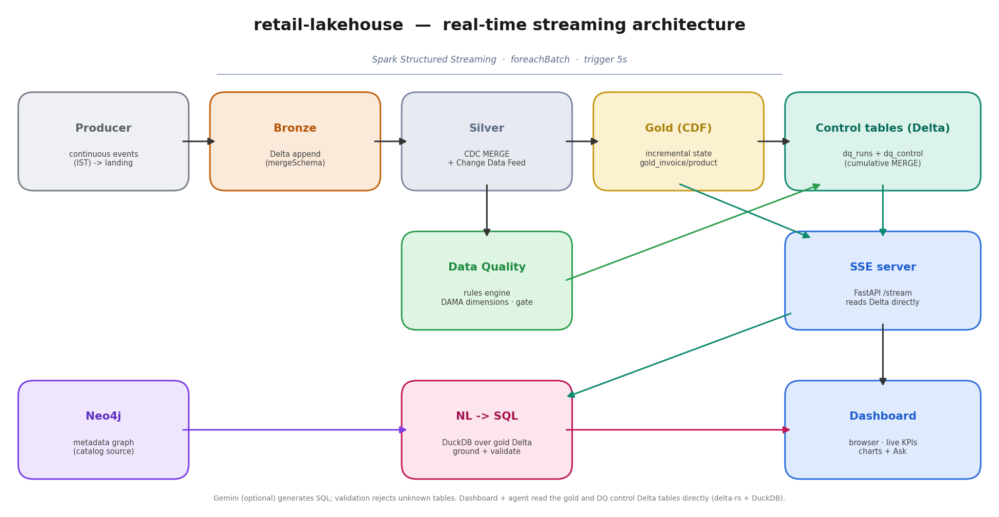
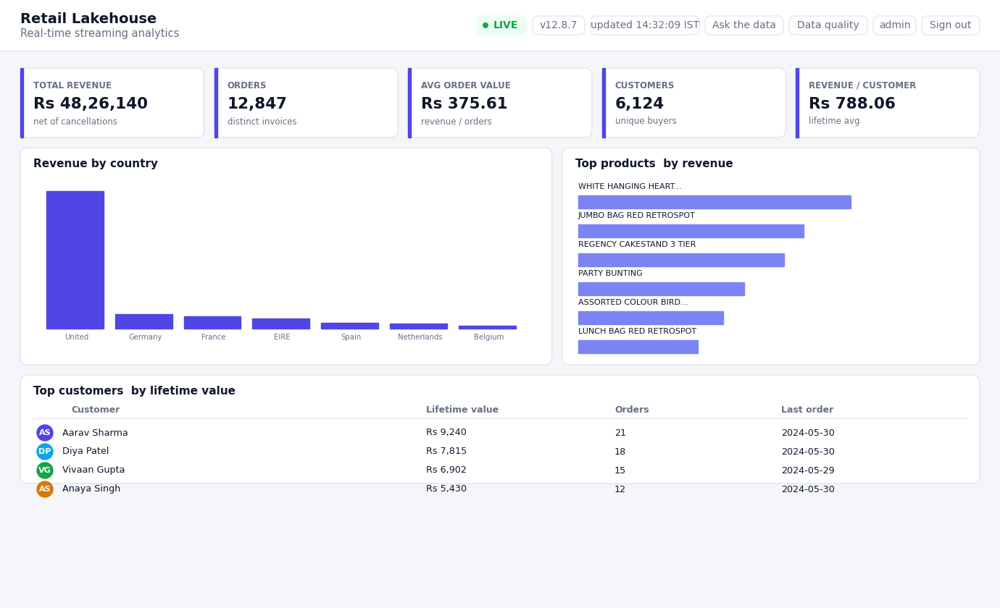

# retail-lakehouse

[](https://github.com/devbansal0905/retail-lakehouse/actions/workflows/ci.yml)

A **real-time** retail analytics lakehouse: a continuous event stream flows
through a Delta **medallion** pipeline (bronze → silver → gold) with per-batch
**CDC MERGE** and **Change Data Feed**, and a **Server-Sent Events** dashboard
updates live in the browser as the data changes.



### Live dashboard


## Stack
`PySpark Structured Streaming` · `Delta Lake` (MERGE + Change Data Feed) ·
`FastAPI` + `Server-Sent Events` · `DuckDB` · `Neo4j` (metadata graph) · optional `Gemini` for NL-to-SQL ·
runs locally or on Databricks.

## How it flows

| Stage | Module | What happens |
|-------|--------|--------------|
| **Producer** | `src/producer.py` | Continuously emits synthetic sales events (one JSON file per tick) into the landing zone — stands in for Kafka/Kinesis/Event Hub. |
| **Streaming pipeline** | `src/stream_pipeline.py` | `readStream` on the landing zone; per micro-batch: append to **bronze**, **MERGE** into **silver** (idempotent CDC upsert, Change Data Feed on), read the silver **CDF** for that version, fold the deltas into compact **gold** state, then MERGE the data-quality result into the Delta **control tables** — only for non-empty batches. No state is held in memory. |
| **Incremental gold** | `src/gold_incremental.py` | Reads only the silver **Change Data Feed** delta, signs each change (+insert / -preimage), and folds it into additive state tables (`gold_invoice`, `gold_product`) via an additive Delta MERGE — per-batch cost scales with change volume, not silver size. |
| **Silver transforms** | `src/silver_transform.py` | Cast types, flag cancellations, filter invalid rows, dedupe, deterministic `line_key`; concurrency-safe MERGE with retry. |
| **Gold** | `src/gold_model.py` | Star schema + KPIs (revenue, AOV, repeat-rate, by-country, top products). |
| **Data quality** | `src/dq_checks.py` + `src/dq_rules.py` | Rules-driven engine run on **every micro-batch**: declarative rules → check registry → single Spark pass, scored per quality dimension, critical-rule gating. Results are written to the Delta **control tables** (`dq_runs` append log + `dq_control` cumulative, additive MERGE) and read live on the **/quality** page. |
| **Realtime web** | `src/realtime_app.py` + `src/auth.py` | FastAPI (reads the gold + DQ **Delta tables directly** via delta-rs + DuckDB — no Spark in the web process) with a username/password **login** (users in Neo4j, PBKDF2-hashed; session cookie). Pages: dashboard `/`, **`/chat`** (NL-to-SQL with per-session history), **`/quality`** (live data-quality). APIs: `/stream` (SSE), `/api/kpis`, `/ask`, `/history`. |
| **NL-to-SQL** | `src/nl_to_sql.py` + `src/metadata.py` + `src/knowledge_graph.py` | Question → SQL **grounded** on a metadata catalog (served from a **Neo4j knowledge graph**, with an in-repo fallback) and **validated**: a generated query that references any table/column not in the catalog is rejected and the model is re-prompted with the error (bounded repairs), else a deterministic rule-based query is used. Runs in DuckDB over the gold Delta tables (KPI views derived on demand). |

## Quickstart (Docker — recommended)
```bash
docker compose up --build      # then open http://localhost:8000
```
See **RUN_WITH_DOCKER.md** for knobs and endpoints.

## Quickstart (local)
```bash
pip install -r requirements.txt
# terminal 1 - continuous event source
python src/producer.py --mode stream
# terminal 2 - Spark Structured Streaming pipeline
python src/stream_pipeline.py
# terminal 3 - real-time dashboard
uvicorn realtime_app:app --app-dir src --port 8000   # open http://localhost:8000
```

## Tests
```bash
pytest -q
```
Covers type casting, cancellation flagging, invalid-row filtering, dedupe +
line-key generation, data-quality violation detection, gold KPI math, and the
NL-to-SQL SELECT-only guard.

## Design notes

**Why medallion.** Bronze is an immutable, replayable record of what arrived;
silver is the cleaned/conformed view; gold is purpose-built for consumption.
Failures isolate to a layer and re-run without re-ingesting.

**Idempotent CDC MERGE.** Each micro-batch upserts into silver on a deterministic
`line_key` (sha256 of the natural key), so reprocessing never duplicates rows.
Change Data Feed is enabled on silver so downstream consumers can read row-level
changes. The MERGE is wrapped in a `DeltaConcurrentModificationException` retry
loop for concurrency safety.

**Incremental gold via CDF.** Rather than rescanning silver each batch, the
pipeline reads only the silver Change Data Feed for the version the MERGE just
produced and folds those signed deltas (+insert / -preimage) into additive state
tables (`gold_invoice`, `gold_product`). Ingestion cost scales with the change
volume, not silver's size; sums are exact and `orders` = distinct invoices is
exact (one row per invoice in `gold_invoice`). A CI test asserts the incremental
result equals a full recompute.

**Change-driven updates.** The SSE server watches the Delta **version** of the
gold + control tables; it pushes to the browser only when a new version is
committed — so the dashboard updates exactly when the data does, not on a timer.

**Grounded, validated NL-to-SQL.** The agent can't query tables that don't
exist: the metadata catalog (Table/Column/Concept nodes in a Neo4j knowledge
graph, seeded from `metadata.py`) is injected into the prompt, and every
generated query is validated against that catalog. Invalid references trigger a
re-prompt with the error (bounded), then a deterministic fallback. Neo4j is
optional at runtime — if it's down, the in-repo catalog is used.

**Quality as a gate.** Rules are declarative data, dispatched through a check
registry, scored per DAMA dimension (completeness / validity / uniqueness /
accuracy); critical rules can gate the pipeline.

**Control tables, read straight from Delta.** Data-quality results are never
held in memory. Each batch appends one row per rule to `dq_runs` and MERGEs a
cumulative, additive row per rule into `dq_control` (matched rules accumulate
their counts and the pass rate is recomputed from the running totals). The
dashboard reads the gold state and both control tables **directly from Delta**
using delta-rs + DuckDB SQL — there is no intermediate snapshot file and no JVM
in the web process. The "current batch" tab is the newest `batch_id` in
`dq_runs`; the "overall" tab is `dq_control`.

## Project layout
```
retail-lakehouse/
├── README.md · architecture.png · requirements.txt · LICENSE
├── src/
│   ├── config.py · spark_session.py · generate_data.py
│   ├── producer.py            # continuous event stream
│   ├── bronze_ingest.py       # landing schema + (batch) bronze ingest
│   ├── silver_transform.py    # clean / dedupe / CDC MERGE (+retry)
│   ├── gold_model.py          # star schema + KPIs
│   ├── dq_rules.py · dq_checks.py   # rules-driven data quality
│   ├── gold_incremental.py    # CDF-driven incremental gold state
│   ├── dq_control.py          # Delta DQ control tables (per-batch + cumulative MERGE)
│   ├── serving.py             # read gold + DQ Delta tables for the dashboard (delta-rs)
│   ├── stream_pipeline.py     # Spark Structured Streaming orchestrator
│   ├── realtime_app.py        # FastAPI SSE server + live dashboard
│   └── nl_to_sql.py           # NL -> guarded SQL (Gemini / rule-based)
├── scripts/download_real_data.py
├── notebooks/exploration.ipynb
├── tests/test_transforms.py
├── Dockerfile · docker-compose.yml · docker/   # runs producer+stream+web
├── .github/workflows/ci.yml                     # ruff + pytest
└── RUN_WITH_DOCKER.md · ruff.toml
```

---
Runs on a synthetic event generator (or the public UCI Online Retail II dataset).
